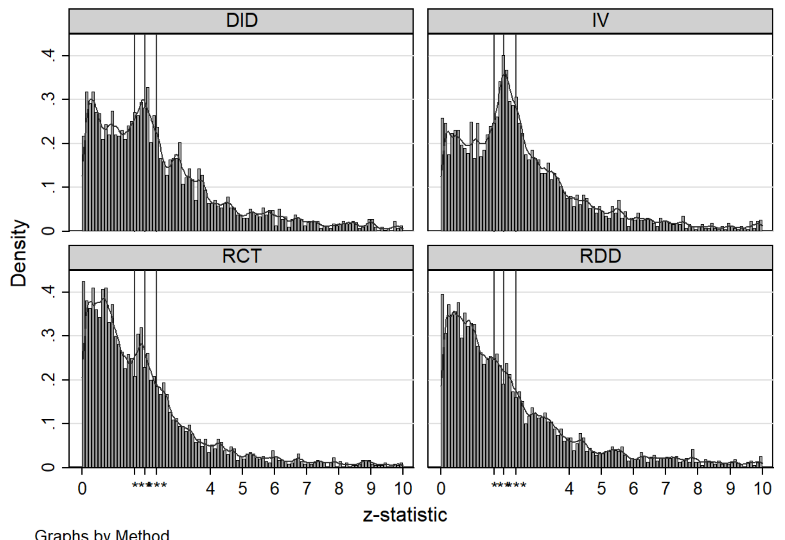
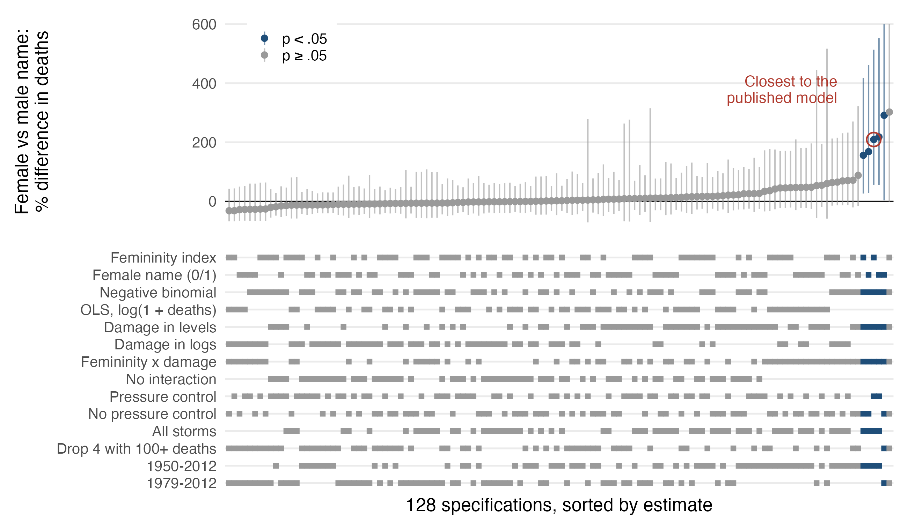
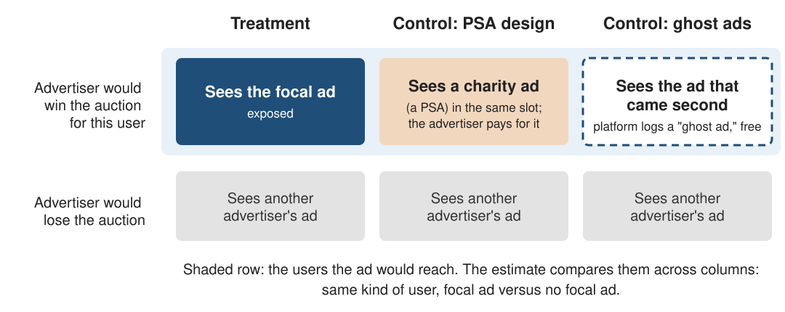

```{css, echo=FALSE}
/* base sizing -- bumped up for classroom projection */
.remark-slide-content {
  font-size: 23px;
  padding: 1em 3em 1.5em 3em;
}
.remark-slide-content h1 { font-size: 46px; }
.remark-slide-content h2 { font-size: 38px; }
.remark-slide-content h3 { font-size: 30px; }

/* code -- wrap rather than overflow the slide */
.remark-code, .remark-inline-code {
  font-size: 20px;
}
.remark-slide-content pre {
  max-width: 100%;
  overflow-x: auto;
}
.remark-code-line {
  white-space: pre-wrap;
  word-break: break-word;
}

/* tables */
.remark-slide-content table {
  font-size: 21px;
}

.large2 { font-size: 165% }
.small90 { font-size: 92% }
.small75 { font-size: 82% }
```

```{r setup, include=FALSE}
library(fontawesome)
library(xaringan)
options(htmltools.dir.version = FALSE)
library(knitr)
opts_chunk$set(
  fig.align="center",
  dpi=300,
  cache=F
  )
```

# The milestones

.small75[
| Week | Due | Milestone | What is inside |
|:--|:--|:--|:--|
| 1 | Aug 26 | Repository initialized | folders, `dadepro` added as collaborator |
| 2 | Sep 2 | Question and data source | one paragraph in the README |
| 3 | Sep 16 | Data acquired; pipeline reproducible; identification memo | fetch script, cleaning script, memo |
| 4 | Sep 23 | Measurement approach; prompt and model; full-corpus run; validation sample designed, drawn, labeled | codebook, prompt and schema, pilot, full-corpus run, sample design and draw, hand labeling |
| 5 | Sep 30 | Validation complete; naive and corrected estimates side by side | confusion matrix overall and by subgroup, naive and corrected estimate |
| **6** | **Oct 7** | **Revised identification memo; robustness plan** | **revision of the Week 3 memo, robustness memo** |
| 7 | Oct 7, Oct 14 | Presentation; written report |  |
]

---

# Where we are

Weeks 4 and 5 were about whether your **variable** means what you think it means.

--

<br>

Today is about whether your **comparison** means what you think it means.

--

<br>

Economics and marketing have worked on this problem for decades. AI makes part of it
harder, because specifications and prompts now cost almost nothing to search over.

---

# Table of contents

1. [The credibility problem, restated](#credibility)

2. [Specification search](#spec)

3. [Pre-registration](#prereg)

4. [Observational designs](#observational)

5. [Experiments](#experiments)

6. [Nulls and publication bias](#nulls)

7. [Provenance and fraud](#provenance)

8. [Journals and the process](#journals)

9. [Where this leaves you](#close)

---
class: inverse, center, middle
name: credibility

# The credibility problem, restated

---

# The question for today

.large2[If a hundred specifications cost nothing to run, what does a reported
specification mean?]

---

# What the credibility revolution assumed

The credibility revolution (Angrist, Imbens, Card, Krueger) moved empirical work toward
research design and away from functional-form assumptions.

--

<br>

Your econometrics sequence is built on that literature.

--

<br>

It also relied on an assumption that was rarely stated: running a specification was
expensive.

---

# Why specifications were expensive

You had to write the code, debug the merge, wait for it to run, and build the table by
hand.

--

<br>

So researchers ran a handful of specifications, perhaps a few dozen over a project's
life.

--

<br>

The published specification was chosen from that small set. The choice was not random,
but the set it was chosen from was small.

---

# What changed

I can ask a model for 500 specifications and have them in an afternoon: combinations of
controls, fixed-effects structures, sample restrictions, winsorization thresholds, and
clustering levels, formatted as a table with significance stars.

--

<br>

Gelman and Loken call the set of analysis choices made after seeing the data the "garden
of forking paths." A model lets you try far more of those paths than was practical
before.

---

# The arithmetic

Suppose 12 binary analyst decisions: include controls or not, log or level, drop
outliers or not, cluster here or there.

--

$2^{12} = 4{,}096$ specifications.

--

<br>

Under a true null with independent tests, the probability that **none** hits $p < .05$ is
essentially zero.

--

The specifications are correlated, so this overstates the problem. The effective number
of tests is still far above one.

--

<br>

You also do not need to run all of them. Stopping the search once a specification gives
the expected answer inflates the false-positive rate in the same way.

---

# How it happens in practice

Specification search is rarely a deliberate decision to p-hack.

--

<br>

What happens is: the first specification gives a null. You think, "the controls are
wrong." You fix them. Now it works. You move on.

--

Each step can be defended on its own. The problem is the stopping rule: the search ends
when the result looks right, so which specification you report depends on the outcome.

---

# What is different now

The classical concerns about specification search all apply, at a larger scale:

--

- More specifications, faster
- Less friction to stop when you like the result
- No paper trail, unless you build one
- A new dimension: the **prompt**

--

<br>

Journal norms, referee checklists, and most methods training were designed when running
a regression took much longer than it does now.

---
class: inverse, center, middle
name: spec

# Specification search

---

# The demonstration

.small90[Simmons, Nelson & Simonsohn (2011), "False-Positive Psychology: Undisclosed
Flexibility in Data Collection and Analysis Allows Presenting Anything as Significant,"
*Psychological Science* 22(11):1359–1366.]

--

<br>

They ran an actual experiment and reported that listening to "When I'm Sixty-Four"
made subjects **younger**.

--

The result was significant at $p < .05$, with real data from real subjects.

---

# How they did it

Four "researcher degrees of freedom," each individually unremarkable:

--

1. Two dependent variables, report the one that works
2. Add 10 more observations if $p$ is close
3. Control for gender, or interact with it
4. Drop one of three conditions

--

<br>

Each is a decision an honest researcher makes. Together, they raise the false-positive
rate from 5% to over 60%.

--

<br>

The paper had a large influence on reporting norms in psychology.

---

# The generalization

Any single analytic choice can be defended.

--

The problem is **choosing which results to report after seeing them**.

--

<br>

Flexibility alone is enough to produce $p < .05$ for an effect that does not exist. No
bad intent is required, only analytic flexibility and a preference for some results over
others.

---

# Does this happen in economics?

.small90[Brodeur, Cook & Heyes (2020), "Methods Matter: p-Hacking and Publication Bias
in Causal Analysis in Economics," *American Economic Review* 110(11):3634–3660.]

--

<br>

They collect tens of thousands of test statistics from top economics journals and look
at the **distribution** of $z$-statistics.

---

# The logic of the z-curve

Under a mix of true nulls and true effects, the density of $z$-statistics should be
smooth.

--

<br>

What you actually see is a **hole just below** the conventional threshold and a **spike
just above** it.

--

<br>

Missing marginal nulls. Excess marginal significance.

--

Sampling variation alone would not produce that shape. It reflects choices by authors,
referees, and editors about what to report and publish.

---

# What the distribution looks like



.small75[$z$-statistics from articles in 25 top economics journals, by method. Vertical lines
at 1.65, 1.96, and 2.58. The bump just above 1.96 is largest for IV and DiD, smaller for
RCT, and absent for RDD. Source: Brodeur, Cook & Heyes, IZA DP 11796 (2018), Figure 1,
the working-paper version of the *AER* article (2015 articles only).]

---

# Results by method

They break it out by method.

--

<br>

**Worst:** instrumental variables (**IV**)

**Also problematic, but less so:** difference-in-differences (**DiD**)

**Better:** randomized controlled trials (**RCT**), regression discontinuity (**RDD**)

--

Read this alongside the published Comment: **Kranz & Pütz (2022)**, *AER* 112(9):3124-3136,
find that after correcting for rounding, the evidence of p-hacking **vanishes for DiD**
while remaining for IV. Reply at 112(9):3137-3139.

--

This is not a statement about which methods are *valid*. It is a statement about how
much **latitude** each one gives you.

---

# Why IV and DiD are p-hackable

**IV:** which instrument, which first stage, which controls, which sample. Weak
instruments make estimates very sensitive to all of these choices, and the exclusion
restriction cannot be tested.

--

**DiD:** which comparison group, which window, which fixed effects, which clustering,
which event-time normalization.

--

<br>

**RCT and RDD** are harder to torture because the design pins down more of the analysis
before you see the outcome.

--

<br>

A design that fixes more of the analysis in advance leaves less room for search.

---

# Multiple hypothesis testing

The mechanical version of the same problem. You have $k$ outcomes, or $k$ subgroups, or
$k$ treatment arms.

--

<br>

Test each at $\alpha = .05$ and your probability of at least one false positive is not
$.05$.

--

With 12 independent tests under the null: $1 - .95^{12} \approx 0.46$.

--

<br>

Close to even odds that at least one result in the table is a false positive.

---

# Two error rates for many tests

When you run many tests, there are two ways to limit false positives.

--

<br>

**Family-wise error rate (FWER): is anything in my list false?** Controlling it at 5%
means the chance that the list of significant results contains even one false positive
is at most 5%.

--

<br>

**False discovery rate (FDR): what share of my list is false?** Controlling it at 5%
means that on average at most 5% of the significant results are false positives. A list
of 20 with one false positive meets it.

--

<br>

.small75[Formally, with $R$ the number of significant results and $V$ the number of false
positives among them: FWER $= \Pr(V \ge 1)$ and FDR $= E[V/R]$.]

---

# How each rule decides

You run $k$ tests at level $\alpha = 5\%$.

--

**Bonferroni** (controls FWER). Declare a test significant if $p < \alpha / k$. With 50 tests, the cutoff
is $.05/50 = .001$, the same for every test.

--

<br>

**Benjamini–Hochberg, BH** (controls FDR). Sort the $p$-values from smallest to largest.
The cutoff grows with the rank: $\alpha \times \text{rank} / k$. With 50 tests it is .001
for the smallest, .002 for the second, .003 for the third, and so on. Find the last
$p$-value below its cutoff, and declare it and every smaller one significant.

--

<br>

.small75[Also worth knowing: **Romano–Wolf**, which controls FWER but uses the correlation
across outcomes, so it declares more tests significant than Bonferroni when outcomes are
related. Implemented
in Stata and R.]

---

# Which one to use

**Bonferroni (FWER).** You test several outcomes and report each significant one as a
finding. It keeps the chance of *any* false positive, across all the tests, at 5%. It is
strict, so you find fewer effects. It works whether or not the tests are correlated.

--

<br>

**Benjamini–Hochberg (FDR).** You test many things to decide which ones deserve a closer
look. It keeps the *share* of false positives among what you find at 5%. It is less
strict, so you find more effects, and a few of them are false.

---

# When do you actually need to correct?

**Yes:** many outcomes, many subgroups, many arms, and you are claiming *any* of them
as a finding.

--

**Yes:** heterogeneity analysis where you searched over splits.

--

<br>

**Not really:** one pre-specified primary outcome. That is the point of having one.

--

**Not really:** a robustness table where every column is estimating the *same*
parameter. Those are not $k$ hypotheses; they are one hypothesis probed $k$ ways.

--

<br>

Robustness checks are not a multiplicity problem.

---

# The practical version

With 12 outcomes, you need a plan for multiplicity. The options:

1. Name **one** primary outcome in advance and treat the rest as exploratory, labeled
2. Build a pre-specified **index** of related outcomes and test that
3. Report adjusted $p$-values alongside raw ones

--

<br>

What you cannot do is report 12 outcomes and write the abstract about the three that
are significant.

---

# Specification curve analysis

A partial remedy is to report every defensible specification instead of choosing one.

--

<br>

Enumerate the set of defensible specifications. Run all of them. Plot the whole
distribution of estimates, sorted, with the analytic choices displayed underneath.

--

<br>

The method is from Simonsohn, Simmons & Nelson (2020), *Nature Human Behaviour*. Steegen
et al. (2016) propose the same idea under the name **multiverse analysis**.

---

# An example: female-named hurricanes

Jung, Shavitt, Viswanathan & Hilbe (2014, *PNAS*) report that damaging hurricanes with
more feminine names kill more people, because people take them less seriously.
Simonsohn et al. (2020) use their data as their worked example.

--

The curve on the next slide is a smaller version built for this class: the same 92
storms and 128 specifications, from seven choices a researcher could defend:

.small90[
- Femininity: a 1–11 rating of the name, or a female-name dummy
- Model: negative binomial on deaths, or OLS on log(1 + deaths)
- Damage control: in levels or in logs, and interacted with femininity or not
- Minimum-pressure control: included or not
- Sample: all storms, or drop the four with 100+ deaths; all years, or 1979 onward, when
  names began alternating between male and female
]

--

The claim is about damaging storms, so every estimate is the effect for a storm at the
90th percentile of damage.

---

# The specification curve



.small75[% difference in deaths between a female- and a male-named storm at the 90th
percentile of damage, with 95% intervals (two truncated at 600%). Data: Jung et al.
(2014). Code: `figures/spec-curve.R` in this lecture's folder.]

---

# How to read it

**Top panel.** Each dot is the estimate from one specification, with its 95% interval.
The specifications are sorted from the smallest estimate to the largest. Blue dots have
$p < .05$.

--

**Bottom panel.** Each column is the specification whose dot sits above it. The marks
show the choice it made on each of the seven decisions. Read down a column to see one
specification; read along a row to see where the estimates using that choice fall.

--

<br>

**What this curve shows.** The median estimate is 2%, and 69 of 128 are positive. Five
are significant, all positive. All five combine the negative binomial, damage in levels,
and the femininity × damage interaction, the combination in the published model
(circled: +209%, 95% CI 56% to 514%). None of the other 112 specifications is
significant.

--

The paper reports the circled specification. The curve shows that the result depends on
those three choices being made together.

---

# What it buys you

If your effect is there in 480 of 500 defensible specifications, that is a much stronger
claim than one table.

--

<br>

If it is there in 60 of 500, that is also informative, and the paper should report it.

--

<br>

Running 500 specifications is now cheap, so the tools that make specification search
easy also make this kind of reporting easy.

---

# Where it can be gamed

The weak point is who decides which specifications are "defensible."

--

<br>

Usually the author, and often after seeing which ones work.

--

<br>

A curve computed over a set chosen to include the preferred specification and leave out
the ones that weaken it has the same search problem as a single table.

---

# So how do you make it credible?

- Define the specification set **before** running it, and say so
- Include the specifications a *hostile* referee would demand, not the ones you like
- Show the distribution, not just "most are significant"
- Report the fraction with the wrong sign, and the median, not just the mode

--

<br>

The curve is informative to the extent that a skeptical reader would have chosen a
similar set.

---

# Prompt search

The same issue arises with prompts.

--

<br>

You wrote a prompt. It gave you 71% accuracy. You rewrote it. 78%. You added few-shot
examples. 84%. You changed the label taxonomy. 88%.

--

<br>

Iterating on a prompt is a form of specification search.

--

Unlike regression specifications, there is no norm yet for reporting prompt iterations.

---

# Why prompt search is harder to audit

With regressions, at least the specification is *visible* in the paper.

--

<br>

With prompts:

- The search happens in a chat window with no log
- The intermediate versions are not saved
- The paper reports one prompt, in an appendix, with no history
- And if you tuned the prompt while watching the **downstream** coefficient, you have
  p-hacked through a measurement instrument

--

<br>

The last case is the most serious. It can happen without intending it: if the
coefficient is on screen while you revise the prompt, it influences which version you
keep.

---

# The rule for your project

Tune the prompt against **hand labels on your pilot documents**, never against the
downstream estimate. The pilot documents stay out of the validation sample.

--

<br>

Freeze the prompt before you run it on the corpus and draw the validation sample, and
before you look at any regression. Version it in `prompts/` and log the iterations in
`ai-log.md`.

--

<br>

The `prompts/` directory and `ai-log.md` from Week 1 are the record of that search.

---
class: inverse, center, middle
name: prereg

# Pre-registration

---

# The idea

The problem is not researcher degrees of freedom but **undisclosed** researcher degrees
of freedom.

--

<br>

Pre-registration turns those choices into a commitment made before you see the
results.

--

<br>

You state, in a timestamped public document, what you will do before you do it.

---

# What a pre-analysis plan contains

- The hypotheses, stated as testable propositions
- The **primary** outcome. Singular, ideally
- Secondary and exploratory outcomes, labeled as such
- The estimating equation, including controls and fixed effects
- The sample and exclusion rules
- The clustering level
- The multiplicity correction, if any
- The power calculation and target $N$
- The stopping rule

---

# What it does not do

**It does not ban exploration.**

This is the most common misreading. You can explore all you want. You are required to
*label* it.

--

<br>

A test written in the plan is **confirmatory**. You committed to it before seeing the
data, so its $p$-value means what it says: if the null is true, a result this extreme
happens 5% of the time.

--

An analysis chosen after seeing the data is **exploratory**. You may have picked it
because it looked interesting, so its $p$-value overstates the evidence. It suggests a
hypothesis to test on new data.

--

<br>

For example, the plan tests whether the badge lowers the share of negative reviews. That
test is confirmatory. If you then notice the effect looks larger in one product
category, that split is exploratory. Both go in the paper, labeled.

---

# What it does not fix

**It does not make a bad design good.** A pre-registered study with a confounded
comparison is still confounded.

--

<br>

**Plans are often vague enough to be unbinding.** "We will estimate the effect of the
treatment on engagement, controlling for relevant covariates." That constrains nothing.

--

<br>

**It is awkward for observational work.** The data already exist. You have probably
already looked at them. Pre-registering after you have looked at the data provides little protection.

---

# The observational case

Most of what you will do in marketing is observational. Pre-registration in its pure
form does not apply.

--

<br>

What *does* transfer:

- Write the identification argument **before** the results
- Specify the primary specification before running the alternatives
- Commit to the robustness checks in advance, including the ones you fear
- Hold out a portion of the data, or a later time period, if the design permits

--

<br>

The mechanism you want is a commitment made before you learn the answer. A registry is
one way to get it; there are others.

---

# For your project specifically

Pre-specify the prompt and the primary specification before looking at any downstream
result.

--

<br>

Write them in your repo and commit them. Git records the date.

--

That commit serves as your pre-registration. It is not public and it is not a registry,
but it is dated, and I can check it.

--

<br>

If the specification you present in Week 7 differs from the one in your Week 6
milestone, say so and explain why. Changes are fine as long as they are reported.

---

# Registries

**AEA RCT Registry**, `socialscienceregistry.org`. Standard for field experiments in
economics. Required by many funders and increasingly expected by editors.

--

**OSF**, `osf.io`. General purpose, flexible, widely used in psychology and marketing.

--

**AsPredicted**, `aspredicted.org`. Nine questions, short, low friction. Good for lab
and online experiments.

--

<br>

All are free. All take under an hour for a simple experiment.

---

# Norms in marketing

Weaker than in psychology, development economics, or experimental economics.

--

<br>

Marketing Science and JMR do not require pre-registration for experimental work.
Reviewers increasingly ask.

--

<br>

This is changing. Registered reports are appearing, and data availability policies have
tightened.

--

<br>

Pre-registering your own experiments takes about an hour and answers a question
reviewers increasingly ask.

---
class: inverse, center, middle
name: observational

# Observational designs

### What a referee asks

---

# The four questions

You have seen these since Lecture 1. Here they are as a referee uses them.

--

1. **What is the estimand?** What number are you trying to learn, for whom?

2. **What is the identifying assumption?** What has to be true for your estimate to be
   that number?

3. **What would break it?** Name the violation.

4. **What is the most damaging alternative explanation?** Not a generic one. The
   specific story a smart skeptic tells.

--

<br>

Your Week 7 presentation should answer all four for your project.

---

# On question 4 specifically

Most papers answer questions 1–3 and skip 4.

--

<br>

It is often the question that determines the referee's recommendation.

--

<br>

Write down the best argument against your result, in its strongest form, and then
address it.

--

Addressing a weak version of the objection does not help, because referees will raise
the strong version.

---

# Difference-in-differences

The workhorse. Treated and control units, before and after.

--

**Identifying assumption:** parallel trends. Absent treatment, the two groups' outcomes
would have moved in parallel.

--

<br>

Note what this is *not*: it is not that the groups are similar. Levels can differ
arbitrarily. It is a statement about **counterfactual trends**, which are unobservable.

--

<br>

So it cannot be tested directly. Evidence can only make it more or less plausible.

---

# What a referee asks about DiD

- Why is this control group the right counterfactual?
- What else happened at the same time to the treated group?
- Is treatment timing correlated with the outcome's trajectory? (Ashenfelter dips.)
- Is anticipation contaminating the pre-period?
- Are there spillovers from treated to control units?

--

<br>

Since about 2021, referees also ask about staggered adoption.

---

# Staggered adoption

If units adopt treatment at **different times** and you run two-way fixed effects with a
single treatment dummy, you need to know what you have actually estimated.

--

<br>

In general, it is **not** the average treatment effect on the treated.

--

<br>

Three papers established this and proposed alternatives.

---

# Goodman-Bacon (2021)

.small90["Difference-in-Differences with Variation in Treatment Timing," *Journal of
Econometrics* 225(2):254–277.]

--

<br>

The decomposition. **TWFE** (two-way fixed effects, the unit-and-time fixed effects
regression) with staggered timing is a **weighted average of all possible 2×2 DiD
comparisons**.

--

Including comparisons of **later-treated to already-treated** units.

--

<br>

In those comparisons, the already-treated unit serves as a control. So its own ongoing
treatment effect enters with the **wrong sign**.

---

# Why that matters

If treatment effects are constant across units and time, the bad comparisons wash out.

--

<br>

If treatment effects are **heterogeneous**, across cohorts or over time, they do not.

--

<br>

The TWFE estimate can then have the **opposite sign** from every unit-level effect in
the data.

---

# de Chaisemartin & D'Haultfœuille (2020)

.small90["Two-Way Fixed Effects Estimators with Heterogeneous Treatment Effects,"
*American Economic Review* 110(9):2964–2996.]

--

<br>

Makes the weights explicit and shows they can be **negative**.

--

<br>

They provide a diagnostic: compute the weights for your own specification and report
how many are negative and how much mass they carry.

--

<br>

The diagnostic takes minutes to run. If the negative weights carry substantial mass, the
TWFE estimate is hard to interpret and you need a different estimator.

---

# Callaway & Sant'Anna (2021)

.small90["Difference-in-Differences with Multiple Time Periods," *Journal of
Econometrics* 225(2):200–230.]

--

<br>

The fix. Estimate group-time average treatment effects $ATT(g,t)$, one for each
adoption cohort $g$ and period $t$, using **clean** comparisons only (never-treated or
not-yet-treated units).

--

Then aggregate deliberately: by cohort, by calendar time, or by event time.

--

<br>

The aggregation is now an explicit choice, rather than a weighting the regression
imposes implicitly.

---

# What this means for you

If your design has staggered adoption:

- Report the Goodman-Bacon decomposition or the negative-weight diagnostic
- Report a robust estimator (Callaway–Sant'Anna, or one of the others in this
  literature) alongside TWFE
- If they differ, report the difference and explain it

--

<br>

Most referees now ask for these diagnostics.

---

# Event studies

Plot coefficients on leads and lags of treatment. The standard visual.

--

<br>

Two things it does:

1. Shows **dynamics**, does the effect grow, decay, or appear immediately?
2. Shows **pre-trends**, were the groups diverging before treatment?

--

<br>

The second is the main reason most DiD papers include one.

---

# The limits of pre-trend tests

Flat pre-trends are reassuring. They are **not** proof of parallel counterfactual
trends.

--

<br>

Three reasons:

--

**Power.** Pre-treatment coefficients are often imprecise. "Not significantly different
from zero" with wide confidence intervals is not evidence of anything.

--

**Selection on the test.** If you chose the comparison group partly because the
pre-trends looked flat, the test is no longer informative. You conditioned on passing
it.

--

**Timing.** A confounder that switches on exactly at treatment leaves no pre-trend at
all.

---

# How to use event studies well

- Plot the coefficients **with confidence intervals**, not just point estimates
- State the normalization period explicitly. It is a choice and it matters.
- Ask whether your pre-period is **powered** to detect a trend large enough to matter
- Treat a flat pre-trend as one piece of evidence, not as the identification argument

--

<br>

The identification argument is a **substantive** claim about why treatment timing is
unrelated to the outcome's path. The event study supports it. It is not a substitute for
it.

---

# Instrumental variables

Need: relevance ($Z$ moves $D$) and the **exclusion restriction** ($Z$ affects $Y$ only
through $D$).

--

<br>

Relevance is testable. Look at the first stage.

--

<br>

The exclusion restriction is an assumption and cannot be tested.

--

<br>

Overidentification tests do not test it. They test whether your instruments agree with
each other. Instruments can be jointly invalid in the same direction and still pass.

---

# Weak instruments

A weak first stage is not merely imprecise. 2SLS is then **biased toward OLS**, and the
bias grows as the first stage weakens.

--

<br>

The old $F > 10$ rule of thumb is too permissive. The current standard is
Montiel Olea–Pflueger effective $F$, or Anderson–Rubin confidence sets, which are valid
regardless of instrument strength.

--

<br>

With a first-stage $F$ of 12, report an AR confidence set rather than relying on the
conventional 2SLS standard errors.

---

# Surprising instruments

Common examples: rainfall, distance to some facility, a historical accident.

--

<br>

A surprising instrument can look credible because it is surprising. Surprise says
nothing about the exclusion restriction.

--

The relevant question is **through what other channels this variable could affect the
outcome**.

--

Rainfall is used to instrument for income, for example to estimate the effect of income
on conflict. Rain is close to random, but the exclusion restriction also requires that
it affects conflict **only through income**.

.small90[
- **Sarsons (2015)**, *J. Development Economics* 115:62–72. In Indian districts
  downstream of irrigation dams, income barely responds to rain, yet rain predicts
  Hindu–Muslim riots as strongly as elsewhere. Rain reaches conflict another way.
- **Mellon (2025)**, *AJPS* 69(3):881–898. Across 289 studies that use weather as an
  instrument, he finds 194 variables linked to weather, each a potential violation.
]

---

# How to defend an IV

- State the exclusion restriction in **words**, as a substantive claim about the world
- Enumerate the alternative channels and address each one specifically
- Show the reduced form. If the reduced form is noise, your IV estimate is a ratio of
  noise to a small number
- Report first-stage strength honestly
- Say what the **LATE** is: whose behavior does the instrument move? That is the
  population your estimate describes, and it is often not the one you care about

---

# Regression discontinuity

Often the most credible observational design when it is available. Treatment is
assigned by whether a **running variable** $X$ crosses a **cutoff** $c$.

--

<br>

**Example.** Yelp shows a restaurant's average rating rounded to the nearest half star.
A restaurant averaging 3.74 shows 3.5 stars; one averaging 3.76 shows 4. Running
variable: the average rating. Cutoff: 3.75. Treatment: the extra half star displayed.

--

<br>

Anderson & Magruder (2012, *Economic Journal*) use this to estimate the effect of the
displayed rating on San Francisco restaurants: an extra half star makes a restaurant
sell out 19 percentage points more often.

---

# The identifying assumption: continuity

$E[Y(0) \mid X = x]$ and $E[Y(1) \mid X = x]$ are continuous in $x$ at the cutoff $c$.

--

<br>

In words: **without the extra half star, average outcomes would not jump at 3.75.**
Restaurants averaging 3.74 and 3.76 are about equally good. Shown the same stars, they
would sell out about equally often.

--

<br>

So if sellouts do jump at 3.75, the displayed stars caused the jump. The RDD estimate
is the size of that jump.

--

<br>

The assumption fails if anything else changes at the cutoff, or if units can choose
their side. For example, owners just below 3.75 might solicit reviews to cross it.
Anderson & Magruder test for this and do not find it.

---

# What a referee asks about RDD

**Bandwidth.** A result that appears at one bandwidth and disappears at another is
fragile. Report a sensitivity curve. Use a data-driven bandwidth (Calonico–Cattaneo–
Titiunik) rather than one you picked.

--

**Functional form.** Local linear with a sensible kernel. High-order global polynomials
behave poorly near the cutoff (Gelman and Imbens, 2019).

--

**Manipulation.** McCrary density test. If the running variable bunches at the cutoff,
someone is sorting, and continuity fails.

--

**Covariate smoothness.** Predetermined characteristics should not jump at the cutoff.
If they do, something else changes there too.

---

# RDD is local

You have estimated an effect for units near the threshold. That is the estimand, not the
average effect in the population.

--

<br>

That is often fine, since the threshold is sometimes exactly where policy operates. But
the paper, including the abstract, should say so.

---

# Matching and selection on observables

You match on covariates, or control for them, and claim conditional independence.

--

<br>

**Identifying assumption:** conditional on $X$, treatment is as good as random.

--

<br>

This is a strong assumption, it cannot be tested, and in most settings it is hard to
defend.

---

# Controls are not an identification argument

> "We control for firm size, industry, and year fixed effects."

--

<br>

Adding covariates addresses confounding **only** by variables you observed and measured
correctly. The confounders to worry about are the ones not in your data, and you cannot
control for those.

---

# When selection on observables is defensible

It sometimes is. The conditions:

--

- You can articulate the **assignment mechanism** and argue $X$ captures it
- You have rich covariates that plausibly span the selection process
- The remaining variation has a story you can tell
- You bound the problem: sensitivity analysis for unobserved confounding (Oster's
  $\delta$, Rosenbaum bounds) rather than asserting there is none

--

<br>

What is not defensible is running the regression, adding controls until the coefficient
stabilizes, and calling stability identification. Coefficient stability under controls
you chose is weak evidence at best.

---

# Placebo and falsification tests

Among the most useful robustness checks, and less common than they should be.

--

<br>

The logic: find a setting where your mechanism predicts **no effect**, and show there is
none.

--

<br>

- Outcomes the treatment should not touch
- Units that should not be affected
- Timing shifted to a period before treatment
- Groups ineligible for the policy

--

<br>

A placebo test is informative because it could have failed. Another significant
coefficient on the main outcome adds less.

---

# Writing a robustness section

Each check gets:

1. A sentence stating **the concern**: "To address the concern that treated markets
   were already on a different trajectory..."
2. The check
3. The result, including when it is weaker

--

<br>

Not a table of 14 columns with no explanation and a sentence saying results are robust.

--

<br>

Before running each check, write down what result would make you abandon the claim. If no
result would, the check adds no information.

---

# Clustering

Cluster at the level of **treatment assignment**.

--

<br>

If treatment varies at the state level, cluster at the state level, even if you have
millions of individual observations.

--

Individual-level clustering with state-level treatment gives you standard errors that
are too small by a large factor. Moulton (1990) documented this, and it
remains a common error.

---

# Few clusters

The asymptotics that justify cluster-robust standard errors are in the **number of
clusters**, not observations.

--

<br>

With 10 or 15 clusters, cluster-robust standard errors over-reject substantially. Your
$t$-statistics are inflated.

--

<br>

Remedies: wild cluster bootstrap (Cameron–Gelbach–Miller), randomization inference, or
$t$-distribution critical values with $G-1$ degrees of freedom.

--

<br>

With 12 states, report the wild cluster bootstrap alongside the conventional clustered
standard errors.

---

# Two common clustering mistakes

**1. Clustering at a level finer than assignment** because it gives smaller standard
errors and someone told you to cluster at the "most granular" level. The standard errors
are then too small.

--

**2. Clustering on the LLM-measured variable's unit** and forgetting that measurement
error from a *shared* prompt is correlated across all observations.

--

<br>

The second is specific to LLM measurement. If one prompt annotated your whole sample, its
errors are not independent across observations, and clustering on another unit does not
remove that correlation.

---
class: inverse, center, middle
name: experiments

# Experiments

---

# Why experiments

You control assignment.

--

<br>

Identification comes from the design rather than from an assumption about the world.

--

<br>

Randomization makes treatment independent of potential outcomes by construction. You do
not need parallel trends, an exclusion restriction, or conditional independence.

--

<br>

This is why RCTs and RDD show the least evidence of p-hacking in Brodeur et al. The
design does the work that specification choices would otherwise have to do.

---

# Failure modes of experiments

They differ from the failure modes of observational designs and are discussed less
often.

--

<br>

- Peeking and optional stopping
- False discovery across many tests
- Underpowered designs
- Interference between units
- Attrition and non-compliance
- Measuring the wrong thing

--

<br>

Randomization does not address any of these.

---

# A/B testing at scale

Every platform runs thousands of experiments a year. Airbnb, Amazon, Meta, Netflix,
Booking.

--

<br>

If you work with industry data, or go to industry, this *is* the empirical environment.

--

<br>

That environment combines many tests, small true effects, and a decision process that
acts on whatever comes back significant.

---

# Peeking

You launch the test and check it on day 2: not significant. Day 4: not significant. Day
6: significant, and the change ships.

--

<br>

The 5% false-positive rate no longer holds.

--

<br>

Fixed-sample $p$-values assume you look **once**, at a pre-specified sample size.

--

Repeatedly testing as data accumulate and stopping at the first significant result
inflates the false-positive rate to well above 5%. Under continuous monitoring with no
correction, it converges toward 1.

---

# The mechanism

The $p$-value path is a random walk. Under the null, it wanders.

--

<br>

If you stop the moment it crosses .05, you are waiting for a random walk to hit a
boundary, which under continuous monitoring it eventually does.

--

<br>

A dashboard that shows a live fixed-sample $p$-value invites this, and many
experimentation platforms show one.

---

# What to do instead

**Fix the sample size in advance** and analyze once. This is the simplest valid
approach.

--

**Group sequential designs.** Pre-specified interim looks with adjusted boundaries
(O'Brien–Fleming, Pocock). Each look uses a threshold stricter than 1.96, set so that
the chance of a false positive across all looks together is 5%. Standard in clinical
trials since the late 1970s.

--

**Always-valid inference.** Sequential $p$-values and confidence sequences that remain
valid under continuous monitoring. This is what the better experimentation platforms
have moved to.

--

<br>

You can monitor continuously. You just cannot use fixed-sample $p$-values while doing
it.

---
class: inverse, center, middle

# Student presentation: Berman & Van den Bulte

**Swaroop Poudel**

Berman & Van den Bulte (2022), "False Discovery in A/B Testing," *Management Science* 68(9):6762–6782.

False discovery from peeking and optional stopping in online experiments

---

# Required reading: false discovery in A/B testing

.small90[**Berman & Van den Bulte (2022), "False Discovery in A/B Testing,"
*Management Science* 68(9):6762–6782.**]

--

<br>

They take a large set of real A/B tests from a commercial experimentation platform and
ask: of the tests declared winners, how many are actually true effects?

---

# The setup

The central point is that this is a **base rate** problem, not a $p$-value problem.

--

If most tested ideas do nothing (which is what the data show), a large share of the
significant results are false positives, even when every test is run correctly.

--

<br>

Suppose 1,000 tested ideas: 100 have a real effect, 900 do nothing. With 80% power and a
5% level:

- $100 \times 0.80 = 80$ real effects come out significant
- $900 \times 0.05 = 45$ null ideas come out significant

So 45 of the 125 "winners," 36%, do nothing.

--

A screening test for a rare disease works the same way. Its **specificity** is the share
of healthy people it correctly clears (here, the 95% of null ideas a 5% test calls not
significant). Even with high specificity, when few people are sick most positives are
healthy.

---

# What they find

Substantial false discovery among declared winners in real testing programs.

--

<br>

Compounded by:

- **Optional stopping**, practitioners peek, and many platforms show live results
- **Many variants** tested at once without multiplicity adjustment
- **Selection**, only winners get implemented and remembered

--

<br>

The organizational consequence: a firm running a large A/B program can systematically
ship changes that do nothing, and believe it is improving.

---

# Why I assigned it

Two reasons.

--

<br>

**One:** many of you will work with platform experimentation data, and this is the
correct prior to bring to it.

--

**Two:** it is a clean demonstration that "we ran an experiment" is not the end of the
credibility conversation.

--

<br>

Randomization addresses confounding. It does not address multiplicity, stopping rules,
or base rates.

---

# Required reading: measuring advertising

.small90[**Johnson, Lewis & Nubbemeyer (2017), "Ghost Ads: Improving the Economics of
Measuring Online Ad Effectiveness," *Journal of Marketing Research* 54(6):867–884.**]

--

<br>

The problem it addresses applies beyond advertising: finding the right control group
when treatment is delivered selectively.

---

# The incrementality problem

Advertising is targeted at people who were already likely to convert.

--

<br>

So the naive comparison, exposed versus unexposed, compares people who wanted the
product to people who did not.

--

<br>

Observational estimates of ad effectiveness are therefore biased upward, often by
multiples of the true effect.

--

Lewis and Rao (2015) show why the bias is large relative to the effect: plausible ad
effects are tiny next to the variance of sales, so a small correlation between exposure
and purchase intent produces a bias larger than the effect itself.

---

# So run an experiment. What is the control group?

You want people who **would have been shown the ad** but were not.

--

<br>

You cannot just withhold ads from a random group and compare. The problem is knowing
*which* control-group users would have been served an ad, because ad delivery depends
on an auction, on competing bids, on targeting, on user behavior at that moment.

--

<br>

Comparing all of the control group to the exposed subset of treatment is comparing the
wrong populations.

---

# The old solution: PSAs

Show the control group a **public service announcement** in the same ad slot.

--

<br>

That identifies who *would* have been served. Now you can compare like with like.

--

<br>

Two problems:

- You **pay** for the PSA impressions. Expensive.
- The PSA itself occupies the slot, which may have its own effects, and you have given
  up the ability to serve a profitable ad there

--

<br>

The design is valid but expensive, so firms rarely used it.

---

# Ghost ads

The design innovation: run a **second simulated auction** to identify which control-group
users *would have* seen the focal ad. And log that, without ever serving it.

--

<br>

Those users just see whatever the platform would have shown anyway: the slot goes to the
next bidder in the ordinary auction.

--

<br>

The counterfactual exposure is **logged**, not purchased.

--

<br>

That is where the cost saving comes from. The design identifies the same
would-have-been-exposed users as a PSA design, without paying for placebo impressions or
giving up the inventory.

---

# The three designs side by side



.small90[Randomization makes the shaded row comparable across columns. The PSA design
finds those control users by paying for charity ads; ghost ads find them by logging the
auction outcome.]

---

# What to take from Ghost Ads

The contribution is a **design**, not an estimator.

--

<br>

They did not find a new way to analyze existing data. They changed what data gets
recorded so the comparison becomes valid.

--

<br>

Changing what gets recorded is often possible, especially if you work with a firm or
build your own measurement pipeline.

--

<br>

Ask, on your own project: *what could I record that would make this comparison clean?*

---

# Power

Run the power calculation **before** the experiment. It takes four inputs:

.small90[
- **Significance level $\alpha$**: the probability of rejecting the null when it is
  true, i.e. the false-positive rate you accept. Usually 5%.
- **Power** $1 - \beta$: the probability of rejecting the null when the true effect equals
  the MDE. Usually 80%, so an effect of that size is missed 20% of the time.
- **Minimum detectable effect (MDE)**: the smallest effect worth detecting, in the
  outcome's units. Set by what would matter, not by what you hope to find.
- **Outcome variance** $\sigma^2$: how noisy the outcome is, from past data or a pilot.
]

---

# Solving for the sample size

For two equal arms and a difference in means, the sample size per arm is

$$N = \frac{2\,(z_{1-\alpha/2} + z_{1-\beta})^2\,\sigma^2}{\text{MDE}^2},
\qquad z_{0.975} = 1.96, \; z_{0.80} = 0.84.$$

With an MDE of $0.1\sigma$: $N = 2 \times 2.8^2 / 0.01 \approx 1{,}570$ per arm.

--

If the required $N$ is larger than you can get, **do not run the experiment as
designed**. You learn this before spending any money.

---

# Post-hoc power

**What it is.** After the study, take your estimate $\hat\beta$, treat it as if it were
the true effect, and compute the power the study had to detect it.

--

**Why it adds nothing.** That power depends only on $z = \hat\beta / \text{SE}$, the same
number that gives the $p$-value. At $\alpha = .05$, two-sided:

| $p$-value | .01 | .05 | .20 | .50 |
|:--|:--:|:--:|:--:|:--:|
| Observed power | 73% | 50% | 25% | 10% |

--

Every result with $p > .05$ has observed power below 50%. So "the null is because the
study was underpowered" follows from the $p$-value by arithmetic. It is not evidence
about the study (Hoenig & Heisey, 2001, *The American Statistician*).

---

# What to report instead

**The confidence interval.** It shows which effects the data rule out. An estimate of
0.02 with 95% CI $[-0.03, 0.07]$ rules out effects above 0.07. If the effects that
matter are around 0.2, the null is informative.

--

<br>

**Power at an effect that matters.** If you want a power statement, compute it at an
effect chosen for substantive reasons (your MDE, or the effect claimed in prior work),
not at your own noisy estimate. Gelman & Carlin (2014) call this a design analysis.

--

<br>

If a reviewer asks for post-hoc power, report both, with one sentence on why observed
power is not informative.

---

# Significance in underpowered studies

A significant estimate from an underpowered study is **more** likely to be exaggerated or
to have the wrong sign than one from a well-powered study.

---

# Why

Low power means only large estimates clear significance.

--

<br>

If the true effect is small, the only way your noisy estimate reaches significance is if
noise pushed it far from the truth.

--

<br>

So conditional on significance in an underpowered design:

--

- The estimate is **exaggerated in magnitude**, Type M (magnitude) error
- It has a non-trivial chance of the **wrong sign**, Type S (sign) error

--

Gelman and Carlin (2014) introduced these terms. Their worked examples report exaggeration factors of
**9.7, 25, and 77**.

--

That last one means a published, statistically significant estimate was **77 times** the
plausible true effect.

---

# The consequence for reading literature

A significant result from a study with $N = 80$ is **weaker** evidence than a null from a
study with $N = 8{,}000$.

--

<br>

It is often read the other way around.

--

<br>

When you referee, ask about power early. When you present,
report the minimum detectable effect. It tells the audience what your design could and
could not have found.

---

# Interference and SUTVA

The stable unit treatment value assumption: one unit's treatment does not affect another
unit's outcome.

--

<br>

In a marketplace, it often fails.

---

# Where it breaks in platform settings

**Two-sided markets.** Treat some buyers with a better ranking algorithm. They book the
good listings. Control-group buyers now face worse inventory. The control group is
affected by the treatment.

--

**Auctions and budgets.** Treated advertisers bid more, raising prices for control
advertisers. Interference through the price.

--

**Social spillovers.** Treated users tell untreated users.

--

**Supply constraints.** Anything with fixed capacity, hotel rooms, drivers, inventory
creates mechanical interference.

---

# What interference does to your estimate

It biases in a direction you can usually sign, and it is often **large**.

--

<br>

If treatment takes bookings from control, the difference overstates the true effect,
possibly by a lot, because part of what it measures is bookings moved, not bookings
created.

--

<br>

A ranking change that moves bookings from listing A to listing B looks like a large
treatment effect at the listing level and may be **zero** at the platform level.

--

<br>

This is a common way for platform experiments to mislead the firms running them.

---

# Partial remedies

**Cluster randomization.** Randomize at the market, city, or region level so spillovers
are contained within units. Costs you power. You now have as many observations as
clusters.

--

**Switchback designs.** Randomize the whole market on and off over time. Standard in
ride-hailing and delivery.

--

**Two-sided / bipartite randomization.** Randomize on both sides to identify
interference terms.

--

<br>

Each costs power or complexity. The alternative is to assume SUTVA holds in a setting
where it does not.

---
class: inverse, center, middle
name: nulls

# Nulls and publication bias

---

# The file drawer

Studies that find nothing are less likely to be written up, less likely to be submitted,
less likely to be accepted.

--

<br>

The published literature is therefore a **biased sample** of the research conducted.

--

<br>

The bias is toward large effects, and it is toward effects estimated with noise, because
noise is what gets marginal studies over the significance line.

---

# What this means for your work

The effect sizes in the literature are **upper bounds**, often by a wide margin.

--

<br>

In practice:

- Your power calculation, based on published effect sizes, is wrong. You will be
  underpowered.
- Your replication fails and you assume you made a mistake
- Meta-analyses inherit the bias unless they correct for it

--

<br>

This is one of the main mechanisms behind failed replications, and it requires no fraud,
only selective publication.

---

# When your effect is not there

This may happen on your project: the timeline is short and the measurement instrument
is new.

--

<br>

The first thing to determine is whether it is a **precise** zero or an **imprecise** one.
The two cases mean different things and are written up differently.

---

# The two cases

**Precise zero.** $\hat\beta = 0.002$, 95% CI $[-0.011, 0.015]$, and the literature
claims effects of 0.15.

You have **ruled out** the effect people believed in. That is a finding. It is
publishable.

--

<br>

**Imprecise zero.** $\hat\beta = 0.002$, 95% CI $[-0.9, 0.9]$.

You have learned little. The data cannot distinguish a large positive effect from a
large negative one.

--

<br>

Both have $p > .05$, but only the first is informative.

---

# Report the interval

Do not stop at "we find no significant effect."

--

<br>

Write: "the estimate is 0.002, with a 95% confidence interval of $[-0.011, 0.015]$,
ruling out effects larger than 1.5%, an order of magnitude below the estimates in
\[literature\]."

--

<br>

Or: "the estimate is 0.002, but the confidence interval spans $[-0.9, 0.9]$, so the
design cannot distinguish economically meaningful effects of either sign."

--

<br>

The second sentence is an accurate report of what the design can tell you.

---

# Making a null informative: equivalence tests

**TOST (two one-sided tests).** Before looking at the estimate, choose $\Delta$, the
smallest effect that would matter. Then test two nulls, each one-sided at level $\alpha$:

- $H_0: \beta \le -\Delta$ (the effect is meaningfully negative)
- $H_0: \beta \ge \Delta$ (the effect is meaningfully positive)

--

Rejecting both shows the effect lies within $(-\Delta, \Delta)$: "no effect large enough
to matter." That is a positive claim, not an absence of evidence. It is the same as the
90% CI (for $\alpha = .05$) lying entirely inside $[-\Delta, \Delta]$.

--

Example with $\Delta$ = 2 percentage points:

- Estimate 0.3 pp, 90% CI $[-1.1, 1.7]$: equivalent. Effects that matter are ruled out.
- Estimate 0.3 pp, 90% CI $[-3.0, 3.6]$: not equivalent and not significant. The data
  cannot tell.

.small75[Lakens (2017), "Equivalence Tests: A Practical Primer," *Social Psychological
and Personality Science*.]

---

# Making a null informative: MDE and bounds

**Minimum detectable effect.** From the standard error alone, the effect the design
could detect with 80% power at $\alpha = .05$ is about $(1.96 + 0.84) \times \text{SE}
= 2.8 \times \text{SE}$. With SE = 0.5 pp, the MDE is 1.4 pp.

Report it: "the design could detect effects of 1.4 pp or larger; smaller effects cannot
be ruled out." This uses the SE, not the estimate, so it is not post-hoc power.

--

<br>

**Bounds.** A null can be produced by attrition or selection, for example when treated
users drop out at a different rate than control users. Instead of a point estimate,
report bounds: Lee (2009) trims the sample to give the range of effects consistent with
the data under weak assumptions. "The effect is between −0.4 and 1.1 pp" is a result.

---

# When nulls get published

Nulls get published when they are **informative about something people believed**.

--

<br>

That requires three things:

1. A design credible enough that people believe the null
2. Precision sufficient to rule out the effect that was claimed
3. A claim in the literature or in practice that your null contradicts

--

<br>

A null from an underpowered design is an absence of evidence, and the paper should say
so.

---

# Nulls in your project

As I said in Lecture 1, a well-designed project that finds nothing gets a higher grade
than a badly identified project that finds something.

---
class: inverse, center, middle
name: provenance

# Provenance and fraud

---

# A case study

One case, described factually.

--

<br>

Fraud is rare. This case is useful because it shows where the field's checking
mechanisms failed and what would have caught it.

---

# The paper

"Artificial Intelligence, Scientific Discovery, and Product Innovation" (arXiv:2412.17866),
by a then-doctoral student at MIT.

--

<br>

Circulated widely in late 2024 and into 2025. Reported that the rollout of an AI tool at
a large materials-science lab produced large increases in materials discovery, patenting,
and product innovation.

--

<br>

It had rich data, a staggered rollout design, heterogeneous effects by scientist
ability, and clear writing.

---

# The reception

Widely praised, including by prominent economists, Daron Acemoglu and David Autor among
them.

--

<br>

Presented at seminars. Covered in the press. Circulated as evidence in the debate about
AI and productivity.

--

<br>

It was, for several months, one of the most discussed working papers in economics.

---

# What happened

In May 2025, MIT issued a public statement saying it had **no confidence in the
provenance, reliability, or validity of the data** and in the veracity of the research.

--

<br>

The university requested withdrawal from arXiv. The paper was withdrawn.

--

<br>

Acemoglu and Autor publicly stated they no longer had confidence in the paper and asked
for it to be withdrawn from circulation.

---

# What the case shows: plausibility

The result was **plausible**. It was **well-written**. And it confirmed what a lot of
smart people already wanted to believe about AI and productivity.

--

<br>

Results like this get the least scrutiny.

--

<br>

Readers scrutinize surprising results most. A result that fits the prior gets less
scrutiny from referees, seminar audiences, and senior people whose endorsement carries
weight.

--

A paper reporting that the tool had no effect would likely have been examined more
closely.

---

# What the case shows: nothing to check

No one outside could check it, because there was nothing to check it **with**:

--

- The firm was anonymous
- The data were proprietary
- There was no public pipeline
- There was no replication package

--

<br>

Readers could judge only plausibility, writing, and the author's institution, and none
of these depends on the data being real.

---

# How the problem surfaced

A computer scientist with domain knowledge of materials science who found the described
setting implausible on technical grounds and raised it with the university.

--

<br>

The check depended on one reader with the right expertise, which is not a reliable
safeguard.

---

# What the case shows: pipelines

Reproducible pipelines and documented provenance are how a field checks results.

--

<br>

The requirements in this course (read-only raw data, scripted transformations, versioned
prompts, logged model calls, a repo that runs from a clean clone) exist so that checking
is *possible*, whether or not anyone ends up doing it.

---

# The question

If someone asked for your project's raw data and pipeline tomorrow, could you hand them
over, and would the pipeline run?

--

<br>

The second part is the one projects usually fail.

---

# Scope

Most results that fail to replicate involve **no fraud**.

--

<br>

The usual causes are specification search, underpowered designs, publication bias, and
coding errors such as a silent merge failure or a model that dropped 40% of the sample.
These are the topics of Week 2 and the first half of today.

--

<br>

The infrastructure that would catch fraud also catches honest mistakes, and honest
mistakes are the main reason to build it.

---
class: inverse, center, middle
name: journals

# Journals and the process

---

# Data availability policies

Norms have tightened substantially, and are still tightening.

--

<br>

**AEA journals:** mandatory data and code deposit, verified by a data editor before
publication. The data editor's team runs the code.

--

**Management Science, Marketing Science, JMR:** data and code policies in place, with
varying enforcement. Increasingly requested at acceptance.

--

<br>

Proprietary data complicate this. They do not exempt you. The expectation is that you
deposit code, document access procedures, and provide enough for someone to replicate
with equivalent data.

---

# What this means practically

Build the replication package as you go, not at acceptance.

--

<br>

The alternative is reconstructing, eighteen months later, what you did to a dataset you
no longer remember, using a package version that no longer exists, with a model endpoint
that has been deprecated.

--

<br>

I have seen colleagues spend weeks on this.

---

# What happens in a review

You submit. A desk-reject filter runs first, editor decides whether it goes out at all.
A large share of submissions never reach a referee.

--

<br>

If it goes out: 2–3 referees, several months.

--

<br>

Outcomes: reject, major revision, minor revision. **First-round acceptance is very
rare.**

--

<br>

An R&R is a good outcome.

---

# Reading a referee report

The first read is usually emotional. Read it, close it, wait 48 hours, and read it again.

--

<br>

On the second read, what felt like hostility is usually a compressed, poorly worded
version of a legitimate concern.

---

# What referee reports actually contain

Three categories, and most of the work is sorting comments into them:

--

**Points where they are right.** Concede cleanly and fix. This is most of the report.

--

**Points where they misunderstood.** Usually your fault. You wrote it unclearly.
Clarify in the text, not just in the letter. If one referee misread it, readers will too.

--

**Points where they are wrong.** These exist. Push back with evidence, respectfully, and
do the analysis that demonstrates it rather than asserting it.

---

# Writing the response letter

- First person plural. "We."
- Reproduce each comment, then respond. **Every** point, including the small ones.
- Concede what is right, explicitly and without hedging: "The referee is correct."
- Push back with **evidence**, never with indignation
- Point to specifics: "Table 2, Column 3," not "our results"
- New material in the letter gets its own numbering (Table I, Figure II)

--

<br>

Open with brief thanks and a numbered summary of the main changes. The editor may read
only that summary, so make it specific.

---

# The two failure modes

**Defensive.** Explaining why every criticism is misguided. It reads as an inability to
take criticism.

--

<br>

**Obsequious.** "We are extremely grateful for the reviewer's brilliant insight," in
every paragraph. It signals that you have no independent judgment about your own paper.

--

<br>

The register you want is **collegial and matter-of-fact**.

---

# On unresolvable disagreements

Sometimes a referee wants something you genuinely cannot or should not do.

--

<br>

Say so. Explain why. Offer the closest feasible alternative and run it.

--

<br>

"We were unable to implement the reviewer's suggestion because \[specific reason\]. We
instead did \[X\], which addresses the underlying concern by \[Y\]."

--

<br>

Editors generally accept this when the reasoning is concrete, and not when it reads as
evasion.

---

# Registered reports

Emerging format. You submit the **introduction, design, and analysis plan** before
collecting data.

--

<br>

Referees review the design. If accepted in principle, publication is **guaranteed
regardless of the result**.

--

<br>

This eliminates publication bias by construction, and it moves referee input to when it
can still improve the study, before the data are collected.

--

<br>

Available at a growing set of journals, still rare in marketing. If you are running a
costly experiment, it is worth asking the editor.

---
class: inverse, center, middle
name: close

# Where this leaves you

---

# The through-line

Weeks 1–3: can anyone check what you did?

Weeks 4–5: does your variable measure what you claim?

Week 6: does your comparison identify what you claim?

--

<br>

A result is credible only if all three hold.

---

# Summary

Cheap computation removed the cost that used to limit specification search.

--

<br>

The limit now has to come from the design and from commitments made before seeing
results: a frozen prompt, a pre-specified primary specification, and a robustness plan
written in advance.

---

# Week 6 milestone

Due before next class (Oct 7):

--

**1. Revised identification memo.** Revisit your Week 3 memo in light of the validation
study and the corrected estimates, with your changes marked. It answers the four
questions explicitly:

- What is the estimand?
- What is the identifying assumption?
- What would break it?
- What is the most damaging alternative explanation, stated in its strongest form?

--

**2. Robustness plan.** `memo/robustness-plan.md`: the checks you will run, each with the
concern it addresses and the result that would make you abandon the claim.

--

Commit both before you look at any further results, so the commit date shows the plan
came first.

---

# How much to revise

If classifier error is correlated with your treatment or your covariates, expect a
rewrite: the estimand may need narrowing, and the identifying assumption may need to be
restated conditional on the error structure.

--

<br>

If the error is modest and plausibly unrelated to the variation you use, and the naive
and corrected estimates agree, a paragraph or two is enough. Report the validation
result, show both estimates, and explain why the identifying assumption is unchanged.

--

<br>

In both cases, report the naive and corrected estimates side by side.

---

# Week 7: presentations

20 minutes presenting, 10 minutes of questions. Everyone presents and everyone attends.

---

# What a good presentation does

**Motivates the question** in about two minutes. Why should anyone care, and what do
we not currently know?

--

**States the estimand and the identifying assumption** explicitly, on a slide, in words.

--

**Shows the validation.** Sampling scheme, confusion matrix, accuracy. This
establishes the instrument.

--

**Shows naive versus corrected.** Side by side. The gap shows
what the correction does.

--

**Is honest about limits.** What you could not rule out, and what you would need to.

---

# What a bad presentation does

Spends twelve minutes on institutional background.

--

Shows a regression table and describes the coefficients out loud without interpreting
them.

--

Says "we validated the measure" without showing the validation.

--

Presents the corrected estimate only, so nobody can see what the correction did.

--

Claims more than the design supports.

---
class: inverse, center, middle

# Questions?

### See you at presentations.
